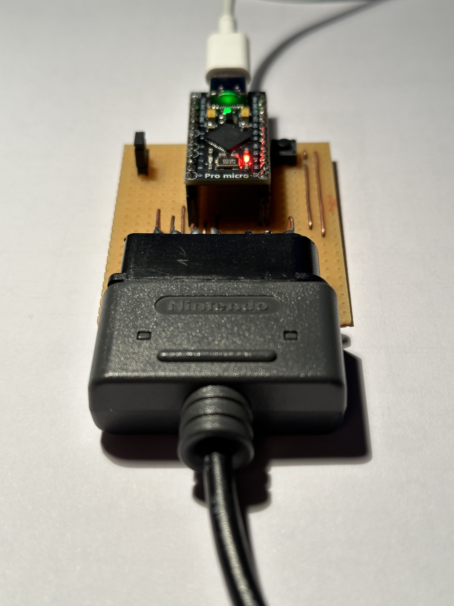
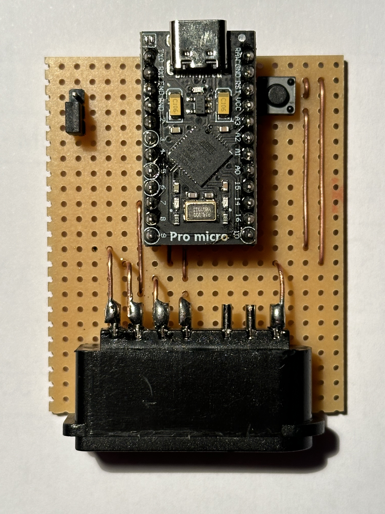

# SNES Controller to USB Adapter

This is a simple adapter to use a [Super NES][1] controller with a computer
via USB.  It is based on the [ATmega32U4][2] microcontroller and uses the
Arduino [`Keyboard.h`][3] library to emulate a keyboard.

It should work with both PAL and NTSC controllers, but I have only tested it
with a PAL controller.

[1]: https://en.wikipedia.org/wiki/Super_Nintendo_Entertainment_System
[2]: https://www.microchip.com/en-us/product/atmega32u4
[3]: https://www.arduino.cc/reference/en/language/functions/usb/keyboard/

## Hardware

  
  

I used an [Arduino Pro Micro][4] clone, but any ATmega32U4-based board should
work, e.g. an Arduino Leonardo.  You can modify the pin assignments in
[`hardware.h`][5], further instruction on how to wire the controller to the
board can be found in the [main sketch][6].

The "lock" pin is a simple pull-up digital input.  When it is not pulled low,
the controller is locked and no input is sent to the computer.  This is useful
when reflashing the board in case of malfunctioning code.  You can short it to
ground if you do not plan to change the code.

Some boards do not have a reset button, you can add one placed between the
reset pin and ground.

[4]: https://www.sparkfun.com/products/12640
[5]: sketches/main/hardware.h
[6]: sketches/main/main.ino

## Software

### Button -> Keyboard mapping

As of current version, the adapter maps the controller buttons as follows:

| SNES button  | Keyboard key |
| ------------ | ------------ |
| L            | l            |
| R            | r            |
| Joypad Up    | Up arrow     |
| X            | x            |
| Joypad left  | Left arrow   |
| Joypad right | Right arrow  |
| Select       | Right shift  |
| Start        | Enter        |
| Y            | y            |
| A            | a            |
| Joypad down  | Down arrow   |
| B            | b            |

### LED feedback

| LED state | Meaning                  |
| --------- | ------------------------ |
| Off       | No power                 |
| On        | Power                    |
| 1 Hz      | Locked (internal switch) |
| 2 Hz      | Controller not connected |

### Compiling and flashing

You can use the Arduino IDE to compile and flash the adapter.  You will probably
need to upload the sketch as on Arduino Leonardo.  Also, if having trouble
flashing the board, be aware of [this issue][7].

[7]: https://forum.arduino.cc/t/arduino-pro-micro-not-recognized/698335
